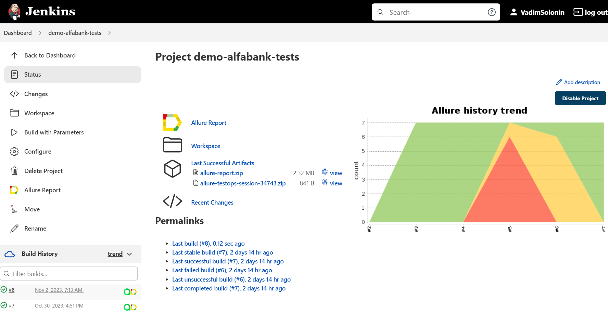
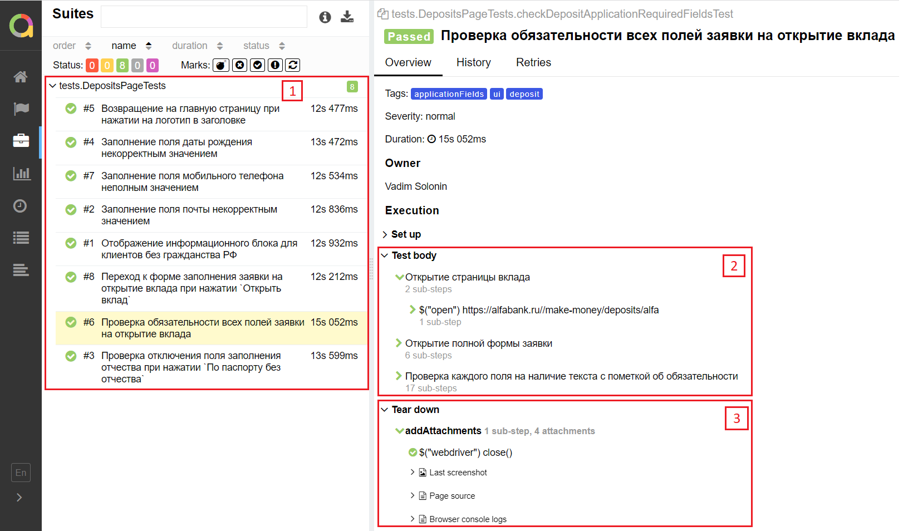

<h1>Демо проект по тестированию сайта "Альфа-Банк"</h1>


<p align="center">

</p>

## Оглавление
+ [Описание](#Описание)
+ [Стек технологий](#Стек-технологий)
+ [Тестовые сценарии](#Тестовые-сценарии)
+ [Запуск тестов](#Запуск-тестов)
+ [Cборка тестов в Jenkins](#Cборка-тестов-в-Jenkins)
+ [Интеграция с Allure Report](#интеграция-с-allure-report)
    + [Диаграммы прохождения тестов](#Диаграммы-прохождения-тестов)
    + [Развернутый результат прохождения тестов](#Развернутый-результат-прохождения-тестов)
+ [Интеграция с Allure TestOps](#Интеграция-с-Allure-TestOps)
+ [Интеграция с Jira](#Интеграция-с-Jira)
+ [Уведомления в Telegram с использованием бота](#Уведомления-в-Telegram-с-использованием-бота)
+ [Пример видеозаписи прохождения тестов](#Пример-видеозаписи-прохождения-теста)

## Описание
Демо-проект с автотестами на Java. В качестве примера была выбрана страница "Вклады".
Особенности проекта:
- Page Object шаблон проектирования
- Возможность запуска тестов: локально, удалённо, по тегам
- Faker для генерации данных
- По итогу прохождения автотестов генерируется Allure отчет. Содержание отчета:
    - Шаги теста
    - Скриншот страницы на последнем шаге
    - Исходный код страницы в браузере
    - Логи консоли браузера
    - Видео выполнения автотеста
- Интеграция с Jira
- Уведомление о результатах прохождения в Telegram

## Стек технологий
| IDEA | Java | GitHub | JUnit5 | Gradle | Selenide | Selenoid | Allure | Jenkins | Allure TO| Jira |
| ------ | ------ | ------ | ------ | ------ | ------ | ------ | ------ | ------ | ------ | ------ |
| <a href="https://www.jetbrains.com/idea/"></a> | <a href="https://www.java.com/"></a> | <a href="https://github.com/"></a> | <a href="https://junit.org/junit5/"></a> | <a href="https://gradle.org/"></a> | <a href="https://selenide.org/"></a>| <a href="https://aerokube.com/selenoid/"></a> | <a href="https://github.com/allure-framework/allure2"></a> | <a href="https://www.jenkins.io/"></a> | <a href="https://docs.qameta.io/allure-testops/"></a> | <a href="https://www.atlassian.com/ru/software/jira"></a>

## Тестовые сценарии
- [x] Переход к форме заполнения заявки на открытие вклада при нажатии `Открыть вклад`.
- [x] Проверка обязательности всех полей заявки на открытие вклада.
- [x] Проверка отключения поля заполнения отчества при нажатии `По паспорту без отчества`.
- [x] Заполнение поля даты рождения некорректным значением.
- [x] Заполнение поля мобильного телефона неполным значением.
- [x] Заполнение поля почты некорректным значением.
- [x] Отображение информационного блока для клиентов без гражданства РФ.

## Запуск тестов:
### 
<details>
   <summary>Локальный запуск</summary>
   
   
1. Клонировать проект и открыть в IntelliJ IDEA
2. Запустить все тесты из терминала командой:
```
gradle clean test
```
3. Запустить тесты, относящиеся к заполнению заявки на регистрацию, можно по тегу `applicationFields`:

```
gradle clean applicationFields
```
   
Дополнительные команды:
1. Выполнить запрос на формирование отчета:
```
gradle allureReport
```
2. Открыть отчет в браузере:
```
gradle allureServe
```
</details>

### 
<details>
   <summary>Удаленный запуск</summary>

Для запуска всех тестов:
```
gradle clean test
```
| Параметры, которые можно добавить | Расшифровка | Значение по умолчанию |
|----------|----------|----------|
| -DbrowserName=${BROWSER}| Название браузера   | chrome   |
| -DbrowserVersion=${BROWSER_VERSION} | Номер версии браузера   | 100   |
| -DbrowserSize=${BROWSER_SIZE}| Разрешение экрана браузера   | 1920x1080   |
| -DremoteUrl=${REMOTE_URL}| Адрес удаленного сервера, на котором будут запускаться тесты   | Прописан в Jenkins   |
</details>

## Cборка тестов в <b><a target="_blank" href="https://jenkins.autotests.cloud/job/demo-alfabank-tests/">Jenkins</a></b>


## Интеграция с <b><a target="_blank" href="https://jenkins.autotests.cloud/job/demo-alfabank-tests/8/allure/">Allure report</a></b>
#### Диаграммы прохождения тестов:


#### Развернутый результат прохождения тестов:
1. Общий список автотестов
2. Содержание автотеста
3. Вложения



## Интеграция с <b><a target="_blank" href="https://allure.autotests.cloud/project/3735/dashboards">Allure TestOps</a></b>
Диаграммы прохождения тестов:


## Интеграция с <b><a target="_blank" href="https://jira.autotests.cloud/browse/HOMEWORK-924">Jira</a></b>


## Уведомления в Telegram с использованием бота


## Пример видеозаписи прохождения теста
<p align="center">
  
</p>
